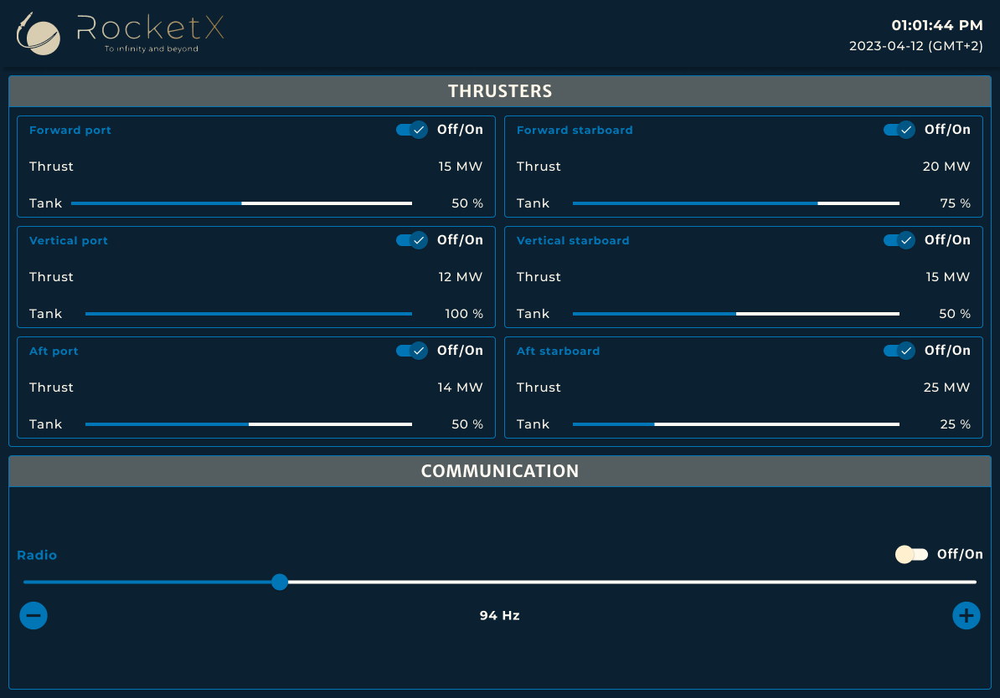

# RocketX HMI

This repository contains technical tests for hiring front-end developers inside Forssea Robotics.

It runs the RocketX's HMI, a web app of a new space rocket.

## Techno & version

This project use:

- [**Node.js v16.20.0**](https://nodejs.org/en/about/releases/) or [**Node.js v18.16.0** (Active)](https://nodejs.org/en/about/releases/)
- [**NPM >=v8.19.4**](https://nodejs.org/en/download/releases/) or [**NPM >=v9.5.**](https://nodejs.org/en/download/releases/)
- [**Angular v16.x.x** (v16-active) Angular CLI](https://github.com/angular/angular-cli)
- [**Node.js Express Framework v4.x.x**](https://expressjs.com/en/4x/api.html)

## Installation

Node.js, npm and Angular are required.

Follow these steps instruction to setup the project.

### Node.js & npm

---

To install globally on Ubuntu a wanted version of Node.js and NPM from NodeSouce repository, run:

```bash
sudo apt-get update
sudo apt-get upgrade

sudo apt install curl # Optional if your system has curl installed
curl -sL https://deb.nodesource.com/setup_16.x | sudo -E bash # (if you want to install another version, you can replace 16.x with your wanted version)

sudo apt-get install nodejs
sudo npm install -g n
```

**You could checked your Node.js and NPM versions with the command:**

```bash
node -v
npm -v
```

See the [official website of Node.js](https://nodejs.org/en/download/) in order to install them on other OS.

### The Angular CLI

---

The Angular CLI is a command-line interface tool that you use to create projects workspace, generate application, develop, scaffold, test, build, deploy and maintain Angular applications and library code directly from a command shell.

#### **Install**

To install globally the latest Angular CLI, run:

```bash
sudo npm install -g @angular/cli@latest
```

To install globally a specific Angular CLI version, run:

```bash
sudo npm install -g @angular/cli@<wanted version> # Exemple: sudo npm install -g @angular/cli@16
```

**You could checked your Angular CLI version with the command:**

```bash
ng version
```

## Clone the project

Clone this project in the folder of your choice.

## Development server

At the project workspace root, run:

```bash
npm run dev:ssr # Launch a locally dev server
```

And then navigate:

- to `Server listening on: http://localhost:<port>`

TODO: add the command to find the port

The application will automatically reload if you change any of the source files.

## UI Design

Find here the final navigation page control UI designed for the V1.



## Your mission

Your mission is to develop a state-of-the-art rocket that will revolutionize space travel. We aim to create a vehicle that is not only efficient and reliable but also affordable, opening up new possibilities for scientific research and commercial ventures.

### Requirements

- The application must be responsive (desktop, tablet and phone).
- Documente the methods implemented.
- Commit your changes regularly.
- Use Angular Material library for toggles, progress bars and the slider (these modules are already available on the app).

### Exercice 1

Your colleague has started to implement the NavBar and Thrusters sections. The controls are functional. But he hasn't been able to finish the work on the UI. Your manager has therefore asked you to take over the project and complete it.

On a feature branch, improve the HTML and CSS of the NavBar and Thrusters sections to match with the mockup.

Once you've finish your task, create a pull request and merge it to `Develop`.

### Exercice 2

Your manager asks you to continue developing the interface by implementing a new feature.

Implement the communication section. Add controls of the radio, following the same logic as that used to control the thrusters.

We want to control :

- The power on/off
- The frequency

### Exercice 3

Finally, our experts tell us that a single thruster would be much better.

Modify the app so that only one motor is possible.

> **_WARNING_** : Don't forget to also modify the URL of your request (see API section).

### Bonus

You've thought of a nice to have on the HMI.

Add a shortcut button to reset the radio frequency to 100 Hz. It's the default communication frequency with the remote control center.

## API

The RocketX HMI API is organized into several sections:

- Thrusters
- Tools

All the endpoints section have a base path:

```Javascript
/api/rocket
```

### Thrusters section

| URL                           | GET | POST | PUT | DELETE | WEBSOCKET |
|-------------------------------|-----|------|-----|--------| --------- |
| `/engine_list`                | Retrieve the current list of all engines state | NA | NA | NA | Retrieve the current list of all engines state |
| `/engine_list/{id}`           | Retrieve the current state of one engine by its ID | NA | Update the state of one engine by its ID | NA | NA |
| `/engine`                     | Retrieve the current state of the engine | NA | Update the state of the engine | NA | NA |

### Tools section

| URL                           | GET | POST | PUT | DELETE | WEBSOCKET |
|-------------------------------|-----|------|-----|--------| --------- |
| `/tools/radio`                | Retrieve the current state of the radio | NA | Update the state of the radio  | NA | Retrieve the current state of the radio |
