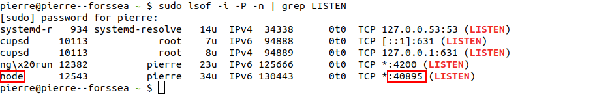

# RocketX HMI

This repository contains technical tests for hiring front-end developers inside Forssea Robotics.

It runs the RocketX's HMI, a web app of a new space rocket.

## Techno & version

This project use:

- [**Node.js v16.20.2 or v18.19.0**](https://nodejs.org/en/about/previous-releases)
- [**NPM v8.19.4 or v10.2.3**](https://nodejs.org/en/about/previous-releases)
- [**Angular v^16.x.x** (v16-LTS)](https://angular.io/guide/releases#actively-supported-versions)
- [**Node.js Express Framework v4.x.x**](https://expressjs.com/en/4x/api.html)

## Setup instructions

Reminder of setup instructions send to you by email in order to start the technical test:

1. Create a Git repository
2. Clone the created repository
3. Download the email Zip file and extract the project
4. Add the extracted project inside your repository
5. Commit the change as initial commit and push it to the main branch
6. Open the README and follow the instructions

## Installation

Node.js, npm and Angular are required.

Follow these steps instruction to setup the project.

### Node.js & npm

---

To install globally on **Ubuntu** a wanted version of Node.js and NPM from NodeSouce repository, run:

```bash
sudo apt-get update
sudo apt-get upgrade

sudo apt install curl # Optional if your system has curl installed
curl -sL https://deb.nodesource.com/setup_16.x | sudo -E bash # (if you want to install another version, you can replace 16.x with your wanted version. Example: 18.x)

sudo apt-get install nodejs
sudo npm install -g n
```

**You could checked your Node.js and NPM versions with the command:**

```bash
node -v
npm -v
```

See the [official website of Node.js](https://nodejs.org/en/download/) in order to install them on other OS.

### The Angular CLI

---

The Angular CLI is a command-line interface tool that you use to create projects workspace, generate application, develop, scaffold, test, build, deploy and maintain Angular applications and library code directly from a command shell.

#### **Install**

To install globally the specific Angular CLI 16 version, run:

```bash
sudo npm install -g @angular/cli@16
```

**You could checked your Angular CLI version with the command:**

```bash
ng version
```

## Install dependencies and run development server

At the project workspace root, run:

```bash
cd GITHUB_REPO_PATH # Change the current directory to the top level of the GitHub repo
npm i
npm run dev:ssr # Launch a locally dev server
```

And then navigate:

- to `Server listening on: http://localhost:<port>`

> **_NOTE_** : if you not see this line, run `sudo lsof -i -P -n | grep LISTEN` in an other terminal window. You will see a process called `node`. Copy the port and go to `http://localhost:<port>` using your browser.


The application will automatically reload if you change any of the source files.

## UI Design

Find here the final navigation page control UI designed for the V1 of RocketX'HMI.


## Your mission

Your mission is to develop a cutting-edge rocket that will revolutionize space travel. We aim to create a vehicle that is not only efficient and reliable but also affordable, opening up new possibilities for scientific research and commercial ventures.

### Requirements

- The application must be responsive (desktop, tablet and phone).
- Document the methods implemented.
- Commit your changes regularly.
- Use Angular Material library for toggles, progress bars and the slider (these modules are already available on the app).
- Data must be updated in real time across multiple open browser windows (websocket network protocol).

### Exercice 1

Your colleague has started to implement the NavBar and Thrusters sections. The controls are functional. But he hasn't been able to finish the work on the UI. Your manager has therefore asked you to take over the project and complete it.

On a feature branch, improve the HTML and CSS of the NavBar and Thrusters sections to match with the mockup.

Once you've finish your task, create a pull request and merge it to `Develop`.

### Exercice 2

Your manager asks you to continue developing the interface by implementing a new feature.

Implement the communication section. Add controls of the radio, following the same logic as that used to control the thrusters. Develop the feature as ergonomic and user-friendly as possible.

We want to control :

- The power on/off
- The frequency

> **_NOTE_** : You must implement an only one instance of the radio model in order to avoid radio interferences.

### Bonus

You've thought of a nice to have feature on the HMI.

Add a shortcut button to reset the radio frequency to 100 Hz. It's the default communication frequency with the remote control center.

## API

The RocketX HMI API is organized into several sections:

- Thrusters
- Tools

All the endpoints section have a base path:

```Javascript
/api/rocket
```

### Thrusters section

| URL                           | GET | POST | PUT | DELETE | WEBSOCKET |
|-------------------------------|-----|------|-----|--------| --------- |
| `/thruster_list`              | Retrieve the current list of state of all thrusters | NA | NA | NA | Retrieve the current list of state of all thrusters |
| `/thruster_list/:id`          | NA | NA | Update the power on/off of one thruster by its ID | NA | NA |

> **_NOTE_** : Thruster PUT request body JSON example: { "powerOn": true }

### Tools section

| URL                           | GET | POST | PUT | DELETE | WEBSOCKET |
|-------------------------------|-----|------|-----|--------| --------- |
| `/tools/radio`                | Retrieve the current state of the radio | NA | Update the state (power on/off or frequency) of the radio  | NA | Retrieve the current state of the radio |
